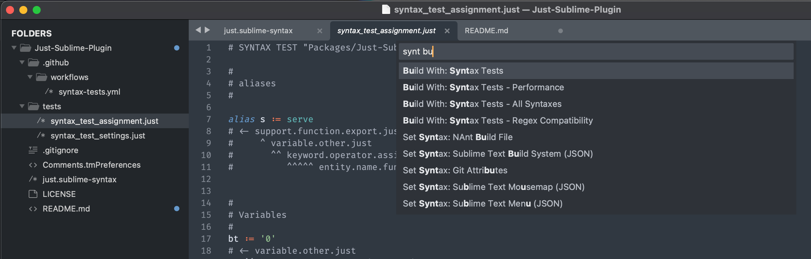
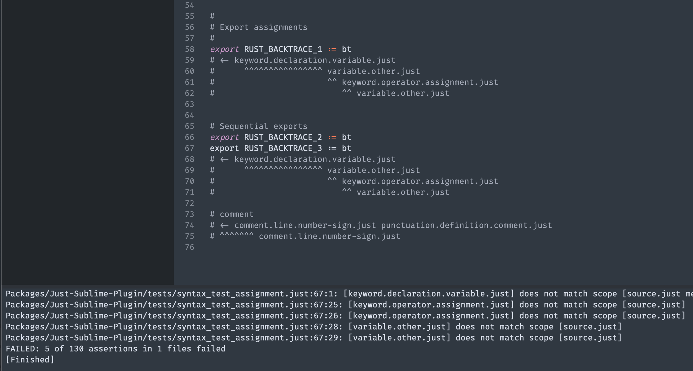

# Contributing

This is an open source plugin, and your PRs are welcome!

## Installing the package
To try this on your own macOS or Linux system, make sure you have [Sublime installed](https://www.sublimetext.com/download). Then [fork this repo](https://github.com/nk9/Just-Sublime-Plugin/fork), download your fork, and symlink it into place. Be sure you change the name of the downloaded repo! This affects the way Sublime displays the syntax, and whether tests will run successfully.

```bash
~ $ git clone https://github.com/<YOUR-GITHUB-HANDLE>/Just-Sublime-Plugin.git Just
~ $ cd Just
Just $ ln -s $PWD ~/Library/Application\ Support/Sublime\ Text/Packages/Just
```

Now the package is installed. You don't have to relaunch Sublime, although you will need to re-open any .just files that are already open.

## Running tests
Sublime contains a [built-in syntax testing system](https://www.sublimetext.com/docs/syntax.html#testing). In fact, it will run whenever code is pushed to GitHub. But before you push any changes, you will want to make sure the tests are running correctly on your local system. To do that, make sure the plugin (with the syntax definition) is installed as above. Then open one of the `syntax_test_` files in the `tests` directory. Then use <kbd>Cmd</kbd>+<kbd>B</kbd> (Build) to run the tests. Alternatively, open the Command Palette (<kbd>Cmd</kbd>+<kbd>Shift</kbd>+<kbd>P</kbd>) and run the `Build With: Syntax Tests` command.



This will open the console and show you the result of the tests.



In this case, the test on line 67 is failing both at column 1, and also in columns 25, 26, 28, and 29.

## Writing tests

There are several shortcuts which can help speed up writing tests in `syntax_test_` files. These are in the [PackageDev](https://github.com/SublimeText/PackageDev) package.

1. Start a line with a `#` and then press <kbd>Tab</kbd>. Sublime will insert sufficient spaces to get you one beyond the last tested character on the line, then insert the necessary number of carets for a string with a contiguous scope, and then *also* add all scopes which match the selected string.

https://user-images.githubusercontent.com/3646730/208213422-1ceec5de-a9a0-418f-b1d8-b0b384a896de.mp4


2. If you want to quickly skip columns, you can use <kbd>Shift</kbd>+<kbd>Tab</kbd> to insert 4 spaces as a time. (`.sublime-syntax` files must use spaces for all indentation.)

3. To reduce the verbosity of the test lines, you can quickly insert ranges of scopes using the `^` key. Press it successively to zoom out to ever larger scopes, although it will only auto-generate scopes forward from the initial caret position. When you add assertions below that one, Sublime will exclude the scopes you've already applied above. This is particularly useful for meta scopes which can span many characters and a number of different concrete scopes.


## Documentation and Tools

- Sublime has great documentation:
    + [Syntax definitions](https://www.sublimetext.com/docs/syntax.html)
    + [Scope naming](https://www.sublimetext.com/docs/scope_naming.html)
    + [Scope naming guidelines](https://github.com/SublimeText/ScopeNamingGuidelines)
    + [Default syntax definitions](https://github.com/sublimehq/Packages/blob/master/Python/Python.sublime-syntax) are available to view and copy
- The [ScopeHunter package](https://packagecontrol.io/packages/ScopeHunter) is on PackageControl, and it is essential. With the Instant Scoper, you will get the scope under the cursor as you move around the file.
- This is a good blog post covering [Sublime syntax](https://haggainuchi.com/sublime.html)
- There is a really useful [thread on GitHub with tips and advice](https://github.com/sublimehq/Packages/issues/757) for building Sublime syntax definitions
- Learn about the regex syntax of the [Oniguruma regex engine](https://github.com/kkos/oniguruma/blob/master/doc/RE) which Sublime's syntax parser uses
- The [Sublime Forum](https://forum.sublimetext.com) has several users who are very knowledgeable and active with syntax questions. Searching the archives can also be a big help.
- Sublime also runs a [Discord server](https://discord.gg/D43Pecu) with the same very helpful folks on it!
