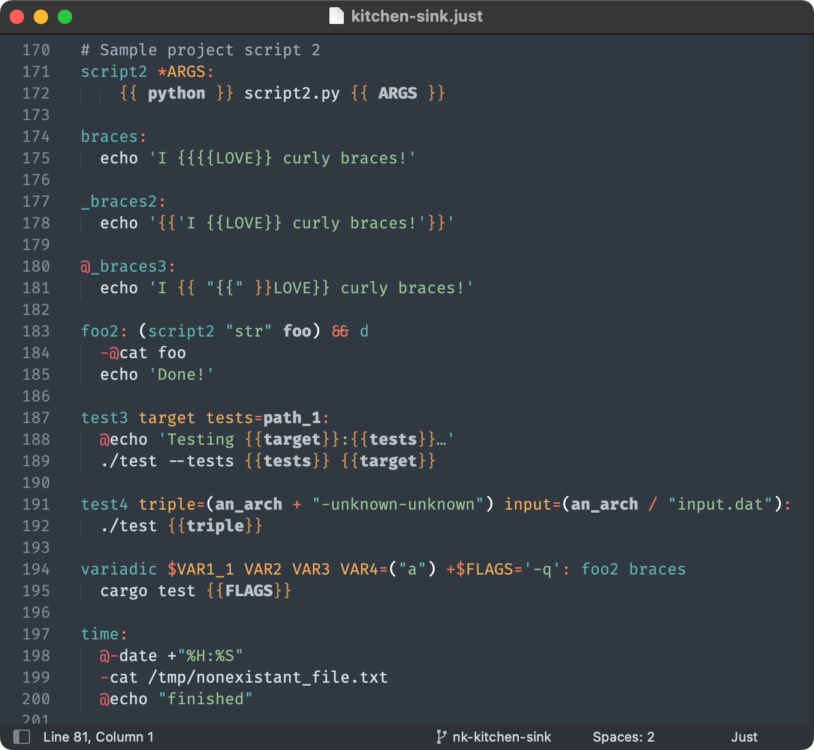

# This Package is Just Sublime

This package contains a few different tools to help you make the most of the [just task runner](https://just.systems).

## Syntax Highlighting

The Sublime syntax has been completely rewritten to be more expressive and support the latest just features. Conditional chaining, interpolation, recipe dependencies, nested groups — the syntax now supports it all!

Get instant feedback as you type when you’ve made a syntax error.

https://user-images.githubusercontent.com/3646730/208213239-83db789f-0ee6-4708-b9ed-a1ce14dcf14b.mp4

## Comments

Use the Sublime comment shortcut (<kbd>Cmd</kbd>+<kbd>/</kbd> to easily comment and uncomment lines.

https://user-images.githubusercontent.com/3646730/208213247-a31a9c4c-f656-4dd1-8109-e42b0a52ad20.mp4

## Check Your Just Code

Just contains a built-in formatter, which also checks your file for correctness. When you install this package, a `Check Justfile` Build System will appear in `Tools > Build System`. It will be available to the Automatic Build System when editing a justfile. You can run it with <kbd>Cmd</kbd>+<kbd>B</kbd> (macOS), and you'll see any changes and errors in the console. You can also find the Build System in the Goto Anything menu (<kbd>Cmd</kbd>+<kbd>Shift</kbd>+<kbd>P</kbd>).

https://user-images.githubusercontent.com/3646730/208213085-ab18099e-553e-4c80-946c-529ef950ced5.mp4

## Contributing

Learn how to edit the syntax in [CONTRIBUTING.md](CONTRIBUTING.md).

